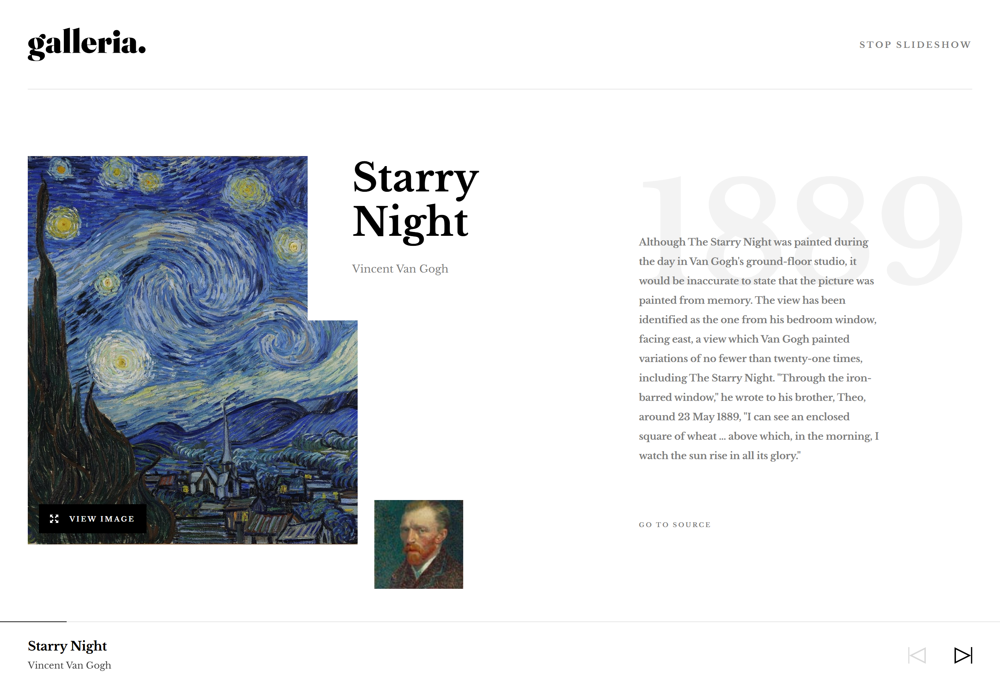

# Frontend Mentor - Galleria slideshow site solution

This is a solution to the [Galleria slideshow site challenge on Frontend Mentor](https://www.frontendmentor.io/challenges/galleria-slideshow-site-tEA4pwsa6).

## Table of contents

- [Overview](#overview)
  - [The challenge](#the-challenge)
  - [Screenshot](#screenshot)
  - [Links](#links)
- [My process](#my-process)
  - [Built with](#built-with)
- [Author](#author)

## Overview

### The challenge

Users should be able to:

- View the optimal layout for the app depending on their device's screen size
- See hover states for all interactive elements on the page
- Navigate the slideshow and view each painting in a lightbox

### Screenshot

### Links

- Solution URL: [GitHub](https://github.com/g-akca/galleria-slideshow-site)
- Live Site URL: [Galleria Slideshow Site](https://g-akca.github.io/galleria-slideshow-site/)

## My process

### Built with

- Semantic HTML5 markup
- CSS custom properties
- Flexbox
- Mobile-first workflow
- Responsive design
- Dynamic JavaScript
- [Tailwind CSS](https://tailwindcss.com/) - CSS framework
- [React](https://reactjs.org/) - JS library
- [Framer Motion](https://motion.dev/) - Animation library

## Author

- GitHub - [@g-akca](https://github.com/g-akca)
- Frontend Mentor - [@g-akca](https://www.frontendmentor.io/profile/g-akca)